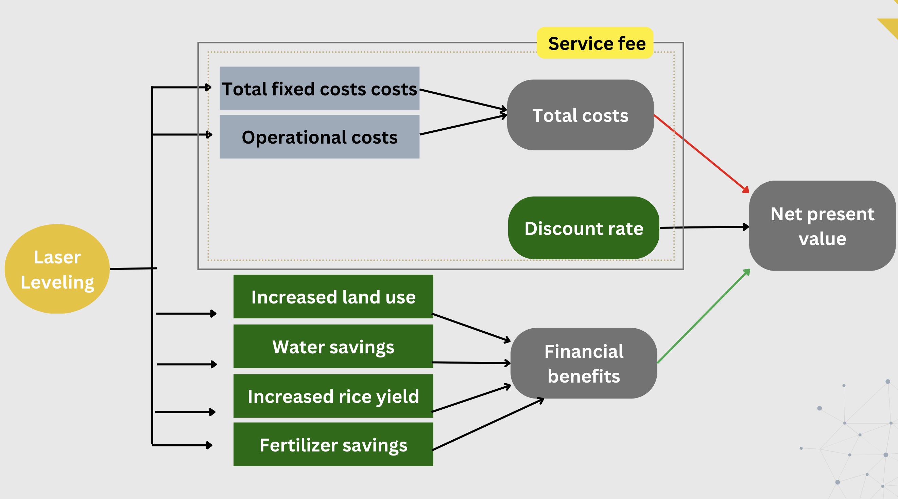
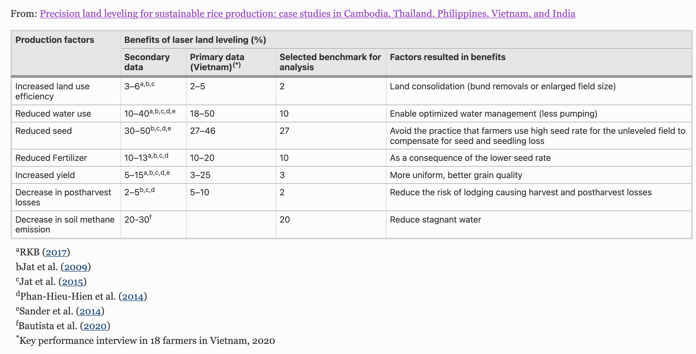
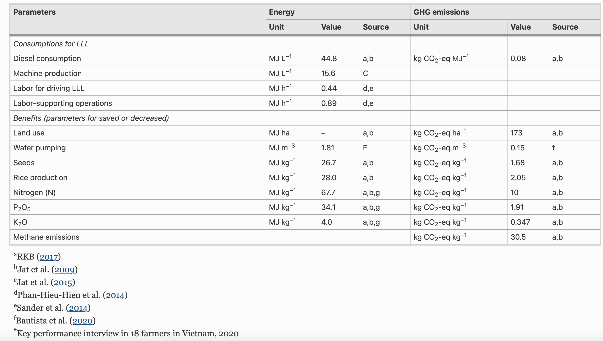
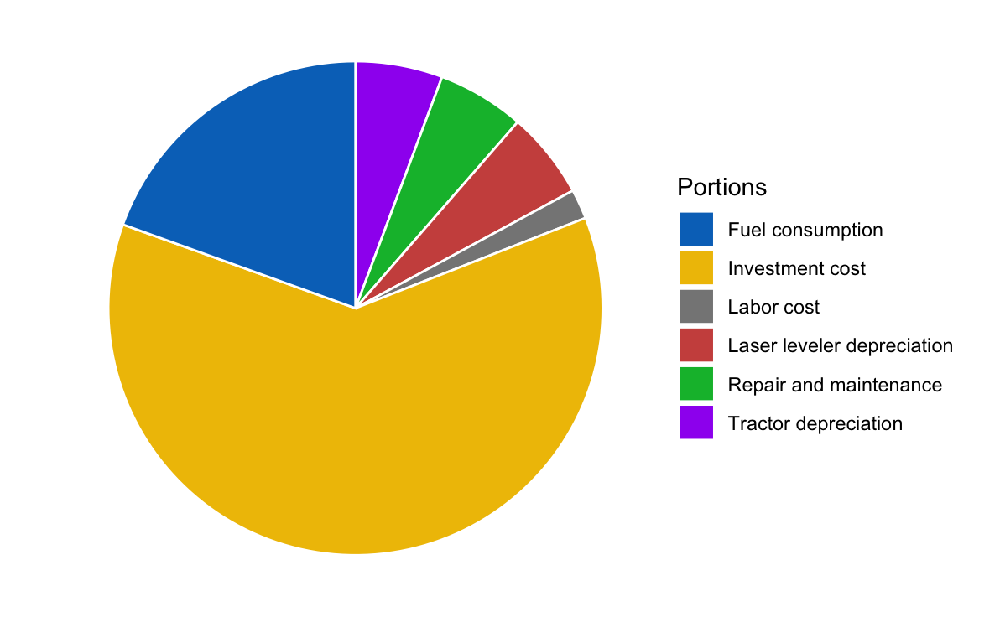

------------------------------------------------------------------------

# Introduction

## Background

-Overview -potential benefits -relevance of the decision for farmers

## Objective

-Determine whether laser leveling should be applied by a small farmer in
Vietnam

# Methodology

-Methods we use -Decision analysis theory

## Decision Criteria (maybe with Data Sources?)

-features of our input table explained and sorted by overlying category
(eg. Economical, Ecological etc.)

**Economical Criteria** cost-effectiveness potential yield improvement
(fertilizer savings, yield increase, seed savings)

**Ecological** (Water use savings, GHGE, soil conservation)

## Package Management Section

```{r package-installation, echo=TRUE}
# Install packages if needed (uncomment code):
# install.packages("decisionSupport")
# install.packages("dplyr")
# install.packages("ggplot2")

library(decisionSupport)
library(dplyr)
library(ggplot2)
```

```{r, warning=FALSE, include = FALSE}
#Automatically write R package citation entries to a .bib file
knitr::write_bib(c(.packages(),
                   'decisionSupport',
                   'dplyr',
                   'ggplot2'),'project_packages.bib')
```

# Data Preparation

## Loading and organizing existing data and assumptions made

```{r data preparation, echo=TRUE}
# data loading and sorting R code:

```

## Conceptual Model

## 

# Analysis

## Cost-benefit Analysis

A cost-benefit analysis comparing the expenses associated with laser
leveling to the potential benefits it may bring to the farmer
cooperatives was conducted. The computations are done under the
assumptions below.

### Assumption sources for 4W tractor laser leveler:




Source: (Nguyen-Van-Hung et al., 2022)


Source: (Nguyen-Van-Hung et al., 2022)


Source: (Nguyen-Van-Hung et al., 2022)



20000 VND-\> minimum wage in Region II Vietnam (Dat, 2023)

7.8% interest rate -\> current rate for short term loans in Vietnam
(Worldbank, 2021)

40-50 USD/hr-\> service fee for plowing

10 cropping seasons-\>LLL will be done every 5 years, and rice
production will be done every cropping season

20% additional input cost per season for re-smoothing of field

### **Formulas used**

𝐼𝑛𝐶𝑜𝑠𝑡𝑓𝑎𝑟𝑚𝑒𝑟=𝐹𝑒𝑒𝑠𝑒𝑟𝑣𝑖𝑐𝑒(1+0.2∗9)

𝑂𝑢𝑡𝑝𝑢𝑡𝑓𝑎𝑟𝑚𝑒𝑟=𝑃𝑟𝑜𝑓𝑖𝑡𝑠𝑒𝑎𝑠𝑜𝑛∗10

𝐼𝑛𝐶𝑜𝑠𝑡𝑠𝑒𝑟𝑣𝑖𝑐𝑒=𝐶𝑜𝑠𝑡𝐷𝑒𝑝𝑟𝑒𝑐𝑖𝑎𝑡𝑖𝑜𝑛+𝐼𝑛𝑡𝑒𝑟𝑒𝑠𝑡+𝐿𝑎𝑏𝑜𝑟+𝐹𝑢𝑒𝑙+𝑇𝑟𝑎𝑐𝑡𝑜𝑟𝑟𝑒𝑛𝑡𝑎𝑙+𝑀𝑎𝑛𝑎𝑔𝑒𝑚𝑒𝑛𝑡

𝑂𝑢𝑡𝑝𝑢𝑡𝑠𝑒𝑟𝑣𝑖𝑐𝑒=𝐹𝑒𝑒 𝑠𝑒𝑟𝑣𝑖𝑐𝑒

### Code

```{r cost-benefit-analysis, echo=TRUE}
library("ggplot2")
library(dplyr)
# cost analysis for LLL service provider (to be paid by farmer)
#declaration of user input variables:
VND<-23487.50 #value of 1 USD to Vietnamese Dong (VND) as of date
###operation (plowing, planting, harvest)
area_covered<- 3 #in ha
working_days<- 60 #in days
hours_day<-10 #number of working hours per day
hrs_area<-(area_covered/working_days/hours_day)*10000 #area to be covered in sq.m per hour

###equipment sizing
speed_op<-7.5 #speed of operation in km/hr
field_ef<-40 #field efficiency in %
LL_size<- 1.5 #commercially available size of drag bucket in m
actual_area<- +(LL_size*speed_op)*(field_ef/100)*1000 #actual area covered in m2/hr

###cost calculation
tractor_price<-30000*VND #purchase price in Vietnamese Dong (VND)
usage_tractor<-1200 #in hrs/yr
LL_price<-12000*VND #purchase price of laser leveler in VND
usage_LL<- +working_days*hours_day #usage of laser leveler in hours/year

##operating costs
engine_power<-37.285 #in kW

fuel_use<-+engine_power/4.2 #in L
fuel_cost<-22622.5 #in VND/L
fuel_cost_hr<-+fuel_cost*fuel_use #fuel cost per hr
repair_maintenance<-tractor_price/10/usage_tractor #VND/hr
labor<-20000 #in VND/hr
total_op_cost<-+repair_maintenance+fuel_cost_hr+labor #in VND/hr

##fixed costs
tractor_dep<-+tractor_price/10/usage_tractor #tractor depreciation in VND/hr
LL_dep<-+LL_price/10/usage_LL #laser leveler depreciation in VND/hr
inv_opp_cost<-7.8 #investment/opportunity cost, a.k.a. interest for borrowing money
inv_cost<-+(tractor_price/usage_tractor)+((LL_price/usage_LL)*(inv_opp_cost/100)) #investment cost in VND/hr
total_fixed_cost<-tractor_dep+LL_dep+inv_cost

total_cost<-+total_op_cost+total_fixed_cost #total cost in VND/hr
land_lvl<-2 #average soil variation in cm
cost_area<-total_cost/(actual_area/10000)*land_lvl #cost/area in VND/ha

###service provider
return_mgt<- 10 #return to management for operating the business in %
service_fee_LLL<-(cost_area*((100+return_mgt)/100))  #in VND/ha, assuming LLL operation of 60 days per year
Input_cost_farmer<-service_fee_LLL*(1+0.2*9) #in VND/ha under the assumption of LL operation every 5 years and resmoothing per season valued at 20%
print(Input_cost_farmer)


#benefits for farmer
seed_rate<-40 #kg/ha
yield<-5500 #at 14% MC, kg/ha
N_fert<-70 #kg/ha
P_fert<-10 #kg/ha
K_fert<-12 #kg/ha
land_use<-200*23487 #benefit in VND/ha/year
seed<-0.6*23487 #benefit in VND/kg
paddy<-0.2*23487 #benefit in VND/kg
fertilizer<-170*23487 #benefit in VND/ha
season_profit<- ((land_use)/2)+(seed*seed_rate)+ (paddy*seed_rate) + (fertilizer)#profit from season's yields and savings after LLL in VND/ha
Output_farmer<- season_profit *10 #VND/ha for 10 cropping seasons
print(Output_farmer)


#benefit-cost ratio
BC_ratio<- Output_farmer/Input_cost_farmer
print(BC_ratio)

#data visualization
cost_shares<-data.frame(Portions=c("Fuel consumption","Repair and maintenance","Labor cost", "Tractor depreciation","Laser leveler depreciation", "Investment cost"), share=c(fuel_cost_hr, repair_maintenance, labor, tractor_dep, LL_dep, inv_cost))


cost_shares <- cost_shares %>%
  arrange(desc(Portions)) %>%
  mutate(lab.ypos = cumsum(share) - 0.5*share)

mycols <- c("#0073C2FF", "#EFC000FF", "#868686FF", "#CD534CFF", "#00BA38","#A020F0")

ggplot(cost_shares, aes(x = "", y = share, fill = Portions)) +
  geom_bar(width = 1, stat = "identity", color = "white") +
  coord_polar("y", start = 0)+
  geom_text(aes(y = lab.ypos, label =" "), color = "white")+
  scale_fill_manual(values = mycols) +
  theme_void()
```



Figure X. Cost proportions of LLL.

## Yield Analysis

Performing an analysis to determine the potential yield improvement
laser leveling could offer in comparison to tradtional farming.

### Assumption sources:


Source: (Nguyen-Van-Hung et al., 2022)

```{r yield-analysis, echo=TRUE}
# yield analysis R:

yield_weight<- 0 #weight of yield (total grains harvested in field at 14% MC) in kg
field_size<-0  #typical field size in Vietnam in ha
GY<- yield_weight/field_size
```

## Sensitivity Analysis

Conducting a sensitivity analysis to assess the impact of varying key
parameters and assumptions on the decision outcome. Maybe explore
different scenarios and evaluate their influence on the decision to
adopt laser leveling?

```{r sensitivity-analysis, echo=TRUE}
# sensitivity analysis R code:

```

# Results

## Monte Carlo Simulation Results

Include: -probability distributions -sensitivity analyses -relevant
metrics or charts that provide insights into the decision-making process

```{r monte-carlo-results, echo=TRUE}
# Monte Carlo simulation results R code:

```

## Data Visualization

The simulated scenarios for the application of laser leveling visualized
using the `ggplot2` package [@R-ggplot2] -Time charts?

```{r data visualization, echo=TRUE}
# R code for vizualisation of results:

```

## Decision Recommendation

-based on the analysis and simulation results of whether or not to
implement laser leveling considering: -decision criteria -cost-benefit
analysispotential risks and uncertainties.

# Conclusion

-summary of the key findings -implications of the recommendation -areas
for future research or consideration

# References

Dat, L. T. Q. (2023). What are monthly and hourly statutory minimum
wages in Vietnam? Retrieved from
<https://lawnet.vn/thong-tin-phap-luat/en/tu-van-luat/what-are-monthly-and-hourly-statutory-minimum-wages-in-vietnam-116511.html>

Nguyen-Van-Hung, Balingbing, C., Sandro, J. *et al.* Precision land
leveling for sustainable rice production: case studies in Cambodia,
Thailand, Philippines, Vietnam, and India. *Precision Agric* **23**,
1633--1652 (2022). <https://doi.org/10.1007/s11119-022-09900-8>

World Bank. (2021). Retrieved from
<https://data.worldbank.org/indicator/FR.INR.LEND?locations=VN>
