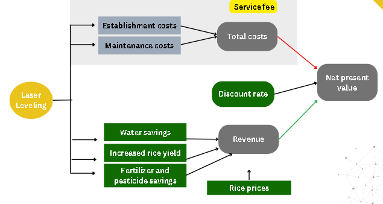

------------------------------------------------------------------------

# Introduction

Water scarcity and the efficient management of water resources have
emerged as major challenges in agricultural development worldwide. With
the increasing impacts of climate change, ensuring sustainable food
production has become a pressing concern. Irrigated rice cultivation
plays a vital role in ensuring global food security, providing a
substantial portion of the world's population with a staple crop
[@bouman_rice_2007]. Rice is a primary dietary staple for billions of
people, particularly in Asia, where it serves as a crucial source of
calories and nutrition [@seck_crops_2012]. Rice consumption has
increased globally over the last decade. Statista data shows that, in
the cropping year 2020/2021, the world population consumed about 504.3
million metric tons of rice, increasing from 437.18 million metric tons
in 2008/2009 [@cuaton_two_2022]. To meet the growing demand for rice and
ensure stable food supplies, efficient water management is essential.
However, irrigated rice farming requires significant water resources,
accounting for a substantial portion of global freshwater consumption
[@food__agriculture_organization_future_2018, @yang_water_2006]. As
water scarcity becomes an increasing concern, optimizing water use in
irrigated rice fields is crucial [@molden_improving_2010]**.**

Irrigated rice fields play a crucial role in Vietnam's agricultural
landscape, providing sustenance for its population and contributing
significantly to the national economy [@ngoc_benefits_2012]. However,
traditional manual leveling methods used in rice cultivation are
time-consuming, labor-intensive, and often result in uneven water
distribution, leading to sub-optimal crop growth and reduced yield
[@tuan_effects_2014]. To address these challenges, laser leveling
techniques have emerged as a promising solution for irrigated rice
fields. Here we enumerate some of the benefits of laser leveling, its
potential impact on agricultural productivity, and its suitability for
the Vietnamese context.

1.  Improved Water Management: Laser leveling technology ensures precise
    land grading, creating a uniform surface with minimal slope
    variations. This accuracy allows for efficient water management and
    enables uniform distribution across the rice fields
    [@nguyen_application_2019]. By achieving a consistent water depth,
    laser leveling reduces water wastage, enhances irrigation
    efficiency, and minimizes the risk of both water-logging and drought
    stress [@ngoc_benefits_2012].

2.  Increased Productivity and Yield: Uneven land surfaces can hinder
    crop growth, leading to uneven maturity and reduced overall yield.
    By providing a flat and consistent terrain, laser leveling promotes
    uniform plant growth, facilitates optimal nutrient absorption, and
    ensures a balanced distribution of sunlight [@tuan_effects_2014].
    These factors collectively contribute to increased crop productivity
    and improved rice grain quality.

3.  Cost and Labor Savings: Traditional manual leveling methods are
    labor-intensive and time-consuming. In contrast, laser leveling
    technology automates the land grading process, significantly
    reducing the need for manual labor [@nguyen_evaluating_2021]. This
    not only saves costs associated with hiring and managing labor but
    also expedites the cultivation process, allowing for timely crop
    rotations and potentially increasing the number of planting cycles
    per year [@hoang_benefits_2018].

4.  Environmental Sustainability: Laser leveling helps mitigate negative
    environmental impacts associated with traditional cultivation
    practices. By optimizing water distribution, it reduces water
    consumption and minimizes runoff, preserving this valuable resource
    [@ngoc_benefits_2012]. Additionally, by promoting uniform crop
    growth, it minimizes the need for excessive fertilizer and pesticide
    applications, thereby reducing chemical runoff and environmental
    pollution.

## Objective

The aim of this project is to determine whether laser leveling should be
applied by a small farmer rice cooperative in Vietnam or not.

# Methodology

Decision analysis is a systematic approach for making decisions under
uncertainty, incorporating mathematical and analytical techniques to
evaluate alternative courses of action and their potential outcomes. It
is a quantitative approach that aims to support decision-making
processes by explicitly considering uncertainties, trade-offs, and
potential consequences.

The decisionSupport package developed by @R-decisionSupport, provides a
systematic framework for making informed decisions based on a
combination of data, models, and stakeholder preferences. This R package
incorporates decision analysis techniques into a user-friendly software
tool, allowing decision-makers to analyze complex problems and evaluate
alternative courses of action. The methodology typically involves the
following steps:

1.  Problem Definition: Clearly defining the decision problem and
    identifying the objectives, constraints, and stakeholders involved.
    This step helps establish a clear understanding of the decision
    context.

2.  Data Collection: Gathering relevant data and information related to
    the decision problem. This may include historical data, expert
    opinions, stakeholder preferences, and other sources of information
    required for the analysis.

3.  Model Development: Developing mathematical or statistical models to
    represent the relationships between different variables and assess
    the potential outcomes of different decisions. The R package
    provides a range of modeling tools and techniques for decision
    analysis.

4.  Uncertainty Assessment: Quantifying uncertainties associated with
    key variables or parameters in the decision problem. This may
    involve statistical analysis, sensitivity analysis, or the use of
    probabilistic modeling approaches to estimate the range of possible
    outcomes.

5.  Decision Evaluation: Integrating the models, data and uncertainties
    to evaluate different decision alternatives. This involves comparing
    and ranking the alternatives based on multiple criteria, considering
    trade-offs and uncertainties.

6.  Sensitivity Analysis: Assessing the robustness of the decision
    results by examining the impact of changes in assumptions, input
    data, or models on the recommended decision.

7.  Communication and Implementation: Communicating the decision
    analysis results effectively to stakeholders and facilitating their
    understanding of the implications and trade-offs. This step helps in
    gaining consensus and support for the recommended decision and
    facilitating its implementation.

The decisionSupport R package provides a comprehensive set of functions
and tools to support decision analysis using the R programming language.
It offers a flexible and customizable platform for implementing decision
support methodologies, enabling users to perform sophisticated decision
analysis tasks efficiently.

## Decision Criteria

Because our main objective is to determine whether laser leveling could
be applied by a small farmer rice cooperative in Vietnam or not, first
we decided to focus on the economic and ecological criteria of laser
leveling, as recommended by [@oertle_potential_2019] since they
highlight the importance of introducing this not so well known topic so
far. They remark that is also important to demonstrate that this
technology could have an economic and environmental potential for
cooperative farmers. We know that we can implement this technology in
Vietnam because the government has implemented the "One Must do Five
Reductions" or 1M5R to promote sustainable rice production, which
includes laser leveling as a strategy. The following steps after this
project would be to hold a stakeholder dialogue to identify barriers and
drivers for future implementation.

For the model building process we determined first all the possible
variables for the economic and environmental components in our model and
design an input table, that is stored locally
as Input_table_LL_decision.csv, this table contains all the input
variables and their values used in the model.

Economical Criteria cost-effectiveness potential yield improvement
(fertilizer savings, yield increase, seed savings)

Ecological (Water use savings, GHGE, soil conservation)

## Package Management Section

```{r package-installation, echo=TRUE}
# Install packages if needed (uncomment code):
# install.packages("decisionSupport")
# install.packages("dplyr")
# install.packages("ggplot2")
# install.packages("knitr")

library(decisionSupport)
library(dplyr)
library(ggplot2)
library(readr)
library(knitr)

#Automatically write R package citation entries to a .bib file
#knitr::write_bib(c(.packages(),
#                   'decisionSupport',
#                  'dplyr',
#                   'ggplot2'),'project_packages.bib')
```

## Conceptual model



# Results

## Monte Carlo Simulation

""" investment_LL = TRUE n_years = 25 establishment_cost_LL = cost_area
\# assuming 1 hectar right now maintenance_cost = (establishment_cost_LL
\* 0.8)/5 \# fictive assumtion that maintenance costs are 80% of initial
investment costs each 5 years Yield = 5400 \# assuming 5.4 tons for
testing Market_price = 0.439 \* VND \# 0.439 USD times VND exchange rate
intervention_communication_cost = 200 \* VND intervention_zoning_cost =
150 \* VND \# Estimate the income in a normal season income_norm \<-
Yield \* Market_price """

```{r, echo=TRUE}
LL_model_function <- function(x, varnames){
  #browser() # enter the debugger 
  
  # calculate ex-ante risks ####
  intervention_No_coop_Event <- chance_event(chance_noLL, 1, 0, n = 1)
  # chance_event chooses with probability "intervention_No_coop_Event" the first scenario (1 in this case), otherwise 0 (no involvement)
  
  # precalculation of common random draws for all intervention model runs
  # benefits of rice cultivation WITH LL:        
    
  # Precalculationn for the change in yield with the intervention of Laser Leveling
  precalc_LL_yield <-
    vv(yield_LL, var_CV, n_years) * # yield [t/ha]
    vv(farm_area, var_CV, n_years) * # area of the field per farmer [ha]
    vv(rice_price, var_CV, n_years) # rice price [USD/t]
  
  # Precalculationn for the water savings with the intervention of Laser Leveling
  precalc_LL_water_savings <-
    vv(LL_water_saving, var_CV, n_years) * # water savings in [m^3/ha]
    vv(LL_water_cost, var_CV, n_years) * # cost of irrigation water [USD/m^3]
    vv(farm_area, var_CV, n_years) # area of the field per farmer [ha]
  
  # Precalculationn for the fertilizer savings with the intervention of Laser Leveling
  precalc_LL_fert_savings <-
    (vv(Fertilizer_cost_noLL, var_CV, n_years) - # fertilizer cost w/o LL [USD/ha]
    vv(Fertilizer_cost_LL, var_CV, n_years)) * # fertilizer cost with LL [USD/ha]
    vv(farm_area, var_CV, n_years) # area of the field per farmer [ha]
  
  # Precalculationn for the pesticide savings with the intervention of Laser Leveling
  precalc_LL_pest_savings <-
    (vv(Pesticide_cost_noLL, var_CV, n_years) - # pesticide cost w/o LL [USD/ha]
    vv(Pesticide_cost_LL, var_CV, n_years)) * # pesticide cost with LL [USD/ha]
    vv(farm_area, var_CV, n_years) # area of the field per farmer [ha]
  
  # Precalculationn for the seed savings with the intervention of Laser Leveling
  precalc_LL_seed_savings <-
    (vv(Seed_cost_noLL, var_CV, n_years) - # seed cost w/o LL [USD/ha]
    vv(Seed_cost_LL , var_CV, n_years)) * # seed cost with LL [USD/ha]
    vv(farm_area, var_CV, n_years) # area of the field per farmer [ha]
  
  # Precalculationn for the fuel savings with the intervention of Laser Leveling
  precalc_LL_fuel_savings <-
    (vv(Water_pumping_fuel_cost_noLL, var_CV, n_years) - # fuel w/o LL [USD/ha]
    vv(Water_pumping_fuel_cost_LL, var_CV, n_years)) * # fuel cost with LL [USD/ha]
    vv(farm_area, var_CV, n_years) # area of the field per farmer [ha]
  
  # Precalculationn for the labor cost savings with the intervention of Laser Leveling
  precalc_LL_labor_savings <-
    (vv(Labor_cost_noLL, var_CV, n_years) - # labor w/o LL [USD/ha]
    vv(Labor_cost_LL , var_CV, n_years)) * # labor cost with LL [USD/ha]
    vv(farm_area, var_CV, n_years) # area of the field per farmer [ha]
  
  # Precalculationn for the change in land use with the intervention of Laser Leveling
   precalc_LL_land_use <-
    vv(LL_land_USD_ha_year, var_CV, n_years) * # land savings LL [USD/ha]
    vv(farm_area, var_CV, n_years) # area of the field per farmer [ha]
  
  # summed benefits of rice production after LL:
  precalc_LL <-
    precalc_LL_yield + 
    precalc_LL_water_savings +
    precalc_LL_fert_savings + 
    precalc_LL_pest_savings + 
    precalc_LL_seed_savings +
    precalc_LL_labor_savings +
    precalc_LL_fuel_savings + 
    precalc_LL_land_use
    
    
    # benefits of rice cultivation WITHOUT LL:
  precalc_conv_prod <-
    vv(yield_noLL, var_CV, n_years) * # yield [t/ha]
    vv(farm_area, var_CV, n_years) * # area of the field per farmer [ha]
    vv(rice_price, var_CV, n_years) # rice price [USD/t]
  
  
  ####  Intervention Preamble ####
  
  # Run a simulation for both the application of LL and the conventional scenario without it:
  for (intervention_LL in c(FALSE,TRUE))
      {
  
  # Set the preambles for the case if LL application:    
  if (intervention_LL)
  {
    event_LL <- TRUE
    event_LL_cost <- TRUE
    event_LL_PlanningCost <- TRUE
    event_conv_rice_prod <- FALSE
  # Set the preambles for the normal rice production scenario
  } else
  {
    event_LL <- FALSE
    event_LL_cost <- FALSE
    event_LL_PlanningCost <- FALSE
    event_conv_rice_prod <- TRUE
  }
  
  if (intervention_No_coop_Event) {
    # only relevant if selected by chance and = TRUE
    # if this condition is TRUE the implementation of LL will be planned but not executed
    event_LL <- FALSE # no LL applied
    event_LL_cost <- FALSE # no establishment costs are created (planning costs however may occur)
    #event_LL_PlanningCost <- TRUE # the planning cost will still be applied since the project is aborted
    event_conv_rice_prod <- TRUE # the normal scenario takes place
}
    
  ####  Intervention ####
  
  # summing up the investment costs if LL is applied or not
  if (event_LL_cost) {
    investment_cost_LL <- establishment_cost_LL
  } else
    investment_cost_LL <- 0
  
  # calculating the planning costs ########MAYBE DONT USE########
  if (event_LL_PlanningCost) {
    plan_cost_intervention_LL <- planning_cost_LL + 
                                  zoning_cost_LL
  } else
    plan_cost_intervention_LL <- 0
  
  # calculating the maintenance costs, initializing the array with 0 costs for the first year:
  maintenance_cost <- rep(0, n_years) 
  
  # Cost of the application of LL per year 
  if (event_LL_cost)
    maintenance_cost <-
    maintenance_cost + 
    # add a variation of the variable over the years
    decisionSupport::vv(maintenance_cost_LL, var_CV, n_years)
  
  # First, all maintenance costs are stored in the variable:
  intervention_cost <- maintenance_cost
  
    # in the first year the establishment costs and planning costs are added:
  intervention_cost[1] <-
    intervention_cost[1] +  # equal to maintenance_cost [1]
    investment_cost_LL +    # equal to establishment costs
    plan_cost_intervention_LL
  
  
   #### Benefits from  cultivation in the intervention strips ####
  
  # Now all benefits of the intervention will be calculated
  # event_LL is 0 if the introduction of LL does not take place, thereby the gains would be multiplied by 0 = become 0
  
  # Benefits of intervention LL:
  intervention_LL_benefits <-
    as.numeric(event_LL) * precalc_LL
  
  # Benefits of conventional rice production (ground truth):
  no_LL_benefits <-
    as.numeric(event_conv_rice_prod) * precalc_conv_prod

  
  
  #### Total benefits from rice production ####
  
  # combined benefits (in reality: intervention_LL_benefits + 0 OR no_LL_benefits + 0)
  #rice_production <- intervention_LL_benefits + no_LL_benefits #not needed since we separate the cases in the next part
  
  
  # if the decision was to implement LL:
  if (intervention_LL){
    net_benefits <- intervention_LL_benefits - intervention_cost
    # save result in result_interv (result intervention):
    result_interv <- net_benefits
    # if the No Cooperation event takes place default to conventional production benefits 
    # but subtract intervention cost (which in this case will only contain planing costs)
    if (intervention_No_coop_Event){
    net_benefits <- no_LL_benefits - intervention_cost
    # save result in result_interv (result intervention):
    result_interv <- net_benefits}
  }

  
  # if the decision was to NOT implement LL:
  if (!intervention_LL){
    net_benefits <- no_LL_benefits - intervention_cost  
    # intervention-cost should be equal to planning costs (intervention_cost = planning costs IF no cooperation event takes place)
    
    # save result in result_n_interv (result NO intervention):
    result_no_interv <- net_benefits}
  
  
    } #close intervention loop bracket
  
  NPV_interv <-
  discount(result_interv, discount_rate, calculate_NPV = TRUE)

  NPV_no_interv <-
  discount(result_no_interv, discount_rate, calculate_NPV = TRUE)

# return all the data we want as output
return(list(LL_NPV = NPV_interv,
            NO_LL_NPV = NPV_no_interv,
            NPV_LL_added_value = NPV_interv - NPV_no_interv,
            Cashflow_LL_added_value = result_interv - result_no_interv))
}
```

Include: -probability distributions -sensitivity analyses -relevant
metrics or charts that provide insights into the decision-making process

#loading the data here for now: Test_Input \<-
read_delim("Test_Input.csv", delim = ";", escape_double = FALSE, trim_ws
= TRUE, header = TRUE) View(Test_Input)

```{r monte-carlo-results, echo=TRUE}
# Generate a random seed
random_seed <- as.integer(Sys.time())  # Get the current time in seconds and convert it to an integer
# Set the random seed
set.seed(random_seed)
# Print the random seed
print(random_seed)


# Monte Carlo simulation results R code:
mcSimulation_results <- decisionSupport::mcSimulation(
  estimate = decisionSupport::estimate_read_csv("Input_table_LL_decision.csv", sep = ';', strip.white = TRUE),
  model_function = LL_model_function,
  numberOfModelRuns = 1e3, #run 10,000 times
  functionSyntax = "plainNames"
)

# 1 ha, 1.8 ha, 20 ha


which.max(density(mcSimulation_results)$y
```

## Data Visualization

The simulated scenarios for the application of laser leveling visualized
using the `ggplot2` package [@R-ggplot2] -Time charts?

```{r data visualization, echo=TRUE}
# Prevent display of digits in scientific notation for numbers up to 6 digits
options(scipen = 100, digits = 6)

# R code for vizualisation of results:

smooth_plt <- decisionSupport::plot_distributions(mcSimulation_object = mcSimulation_results, 
                                    vars = c("LL_NPV", "NO_LL_NPV"),
                                    method = 'smooth_simple_overlay',
                                    base_size = 16,
                                    colors = c("#FFC300", "#9f3ee2"),
                                    x_axis_name = "Outcome distribution [USD] NPV (N = 10,000)",
                                    y_axis_name = "Density of Estimations")

smooth_plt +
  scale_x_continuous(limits = c(-10000, 360000), breaks = seq(-100000, 300000, by = 100000)) +
  ggtitle ("Density of NPV Estimations") +
  #geom_hline(yintercept = median(c("LL_NPV", "NO_LL_NPV")), color="blue")
  geom_hline(yintercept = median(mcSimulation_results$LL_NPV), color = "red", linetype = "dashed")


hist_plt <- decisionSupport::plot_distributions(mcSimulation_object = mcSimulation_results, 
                                    vars = c("LL_NPV", "NO_LL_NPV"),
                                    method = 'hist_simple_overlay', 
                                    base_size = 16,
                                    colors = c("#FFC300", "#9f3ee2"),
                                    x_axis_name = "Outcome distribution [USD] NPV (N = 10,000)",
                                    y_axis_name = "Number of Outcomes in Bin")

hist_plt +
  scale_x_continuous(limits = c(-10000, 360000), breaks = seq(-100000, 300000, by = 100000))


NPV_names = c("Rice Production with Laser Leveling NPV", "Conventional Rice Production NPV")
decisionSupport::plot_distributions(mcSimulation_object = mcSimulation_results, 
                                    vars = c("LL_NPV", "NO_LL_NPV"),
                                    method = 'boxplot',
                                    new_names = "NPV_names",
                                    base_size = 16,
                                    colors = c("#FFC300", "#9f3ee2"),
                                    x_axis_name = "Outcome distribution [USD] NPV (N = 10,000)",
                                    y_axis_name = NULL)

decisionSupport::plot_distributions(mcSimulation_object = mcSimulation_results, 
                                    vars = "NPV_LL_added_value",
                                    method = 'boxplot_density',
                                    base_size = 16,
                                    colors = "#FFC300",
                                    x_axis_name = "Outcome distribution [USD] added value (N = 10,000)",
                                    y_axis_name = "Density of Estimations")


plot_cashflow(mcSimulation_object = mcSimulation_results, cashflow_var_name = "Cashflow_LL_added_value")


```

## Projection to Latent Structures (PLS) analysis

Application of post-hoc analysis to `mcSimulation()` outputs

```{r, echo=TRUE}
library(decisionSupport)

#select the 3rd outcome variable "NPV_LL_added_value" from the mcSimulation results and run PLS simulation
pls_result <- plsr.mcSimulation(object = mcSimulation_results,
                  resultName = names(mcSimulation_results$y)[3], ncomp = 1)

input_table <- read.csv("Input_table_LL_decision.csv", sep = ";")
                        
plot_pls(pls_result, input_table = input_table, threshold = 0)

```

## Value of Information Analysis

Value of Information Analysis conducted using EVPI.

```{r, echo=TRUE}
#here we subset the outputs from the mcSimulation function (y) by selecting the correct variables
# this should be done by the user (be sure to run the multi_EVPI only on the variables that the user wants)
mcSimulation_table <- data.frame(mcSimulation_results$x, mcSimulation_results$y[1:3])

evpi <- multi_EVPI(mc = mcSimulation_table, first_out_var = "LL_NPV")
#> [1] "Processing 3 output variables. This can take some time."
#> [1] "Output variable 1 (LL_NPV) completed."
#> [1] "Output variable 2 (NO_LL_NPV) completed."
#> [1] "Output variable 3 (NPV_LL_added_value) completed."

plot_evpi(evpi, decision_vars = "LL_NPV")
#> Warning: There are no variables with a positive EVPI. You probably do not need a
#> plot for that.
#> 
compound_figure(mcSimulation_object = mcSimulation_results, input_table = input_table, plsrResults = pls_result, EVPIresults = evpi, decision_var_name = "NPV_LL_added_value", cashflow_var_name = "Cashflow_LL_added_value", base_size = 7)

```

## Decision Recommendation

-based on the analysis and simulation results of whether or not to
implement laser leveling considering: -decision criteria -cost-benefit
analysis potential risks and uncertainties.

# Conclusion

-summary of the key findings -implications of the recommendation -areas
for future research or consideration

# References
